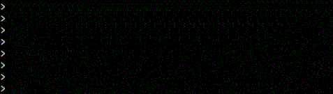

# Code to Answer Coding Interview-Style Questions

Run TestScreenAsBytes.java.

Run TestSingleCharacterEdit.java.

Java code to answer a number of coding interview style questions.  

# Single character edits

There are three sorts of single character edit that can be made to a string:

* Replacing one character with another, at some position
* Removing a character, from some position
* Inserting a character at some position, before what was previously there

The method in the `SingleCharacterEdit` class takes two strings, `a` and `b`, and returns a String that prescribes what single-character edit will turn a into b; or returns `null` if no such single-character edit exists.  The format of the string returned is as follows:

* If the character at position *n* was replaced with the character *c*, return the string `replace,n,c`.  For instance, if character 1 was replaced with an x, return `replace,1,x`
* If the character at position *n* was removed, return `remove,n`.  For instance, if the first character was removed, return `remove,0`.
* If a new character *c* was inserted at position *n*, return the string `insert,n,c`.  For instance, for input strings `cat` and `chat`, return `insert,1,h`

## Usage

To test this code, run the given class `TestSingleCharacterEdit`.  This will perform some basic testing of the code by calling it and checking it gives the right outputs.

# A screen as bytes

Each pixel on a monochrome (black and white) screen can be represted as a bit -- either off (0) or on (1).  The whole screen can in turn be represented as an array of bytes, with each byte storing eight pixels (eight bits).  The first bytes in the array are the pixels at the left of the top row of the image; and the last bytes in the array are the pixels at the right of last row of the image.  For instance, the following image, 16 pixels wide and 3 pixels tall:

`1111....1111....`  
`....1111.......1`  
`1111....1111...1`  

...becomes the bytes (in binary):

`{11110000,11110000,00001111,00000001,11110000,11110001}`

...or in decimal:

`{240,240,15,1,240,241}`

## Usage

To test the code, run the given class `TestScreenAsBytes`.  This will perform some basic testing of the code, by calling it and checking it gives the right outputs.

## Drawing a single pixel

The method `setPixel` in the given class `ScreenAsBytes` takes as input:

* The bytes representing the screen, as described above
* The width of the image.  Assume this is a multiple of 8. *I work out the height of the image from the length of the array, and the width.*
* The x and y positions of the pixel

The method modifies `screen` so the given pixel has a value of 1.  For instance, for a screen 16 pixels wide and 3 pixels tall that is entirely blank (all pixels set to zero), screen would be

`00000000,00000000,`  
`00000000,00000000,`  
`00000000,00000000`  

...or in decimal `{0,0,0,0,0,0}`.  After calling `setPixel(screen,16,0,1)` to set the first pixel on the second row to 1, screen should be:

`00000000,00000000,`  
`10000000,00000000,`  
`00000000,00000000`  

...or in decimal `{0,0,128,0,0,0}`

## Usage

To perform a basic test of the code, run TestScreenAsBytes, which as the first test will set a single pixel of the image to 1 and check the correct one has been set.

## Drawing a horizontal line

The method `drawHorizontalLine` takes as input:

* The bytes representing the image, and its width (like `setPixel`)
* The start and end X positions of the horizontal line *inclusive*
* The y position at which to draw the line (0 for the first 1, 1 for the next row, and so on)

The method modifies `screen` to contain a horizontal line drawn at the correct position. 

## Usage

To perform a basic test of the code, run TestScreenAsBytes, which as the second test will draw a horizontal line on the image and check the correct pixels have the value 1.

## Drawing a vertical line

The method `drawVerticalLine` is the vertical equivalent of `drawHorizontalLine` and takes as input:

* The bytes representing the image, and its width
* The X position at which to draw the vertical line
* The start and end Y positions for the line *inclusive*.
